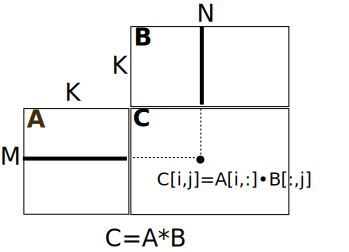
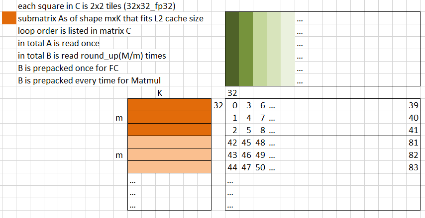

# GEMM(Matmul) using AMX(BF16)

## GEMM Formula

$$
C_{ij} = \sum_{k} A_{ik} \cdot B_{kj}
$$

With:

 - A matrix as MxK
 - B matrix as KxN
 - C matrix as MxN

Note above formula is usually generalized to matrix blocking case where:

 - element $A_{ik}$ becomes a sub-matrix of A with size m⨯k
 - element $B_{kj}$ becomes a sub-matrix of B with size k⨯n
 - element $C_{ij}$ becomes a sub-matrix of C with size m⨯n
 - the multiply $\cdot$ becomes matrix multiplcation $A_{ij}^{m⨯k} \cdot B^{k⨯n}_{kj}$

with this generalization, orginal definition becomes a special case where :

 - m=n=k=1
 - sub-matrix is degenerated into scalar
 - multiply $\cdot$ becomes a scalar multiplication.



consider each dot in above graph as an element, which is sub-matrix in general.

## Baisc calculation scheme

As shown in Intel manual[^1], AMX can do sub-matrix multiplication & accumulation with tile registers (which has 2D layout instead 1D/vector registers used in SIMD).

As brgemm paper [^brgemm] suggested, we should choose the size of sub-matrix of C so it can fit tile register(s), and load & store it only once, before & after all accumulations into it were done.

Thus the basic flow is, for each sub-matrix $C_{ij}$, we do what specified in GEMM Formula:

 1. load $C_{ij}$ into tile registers
 2. go over the dimension K:
    - load sub-matrix $A_{ik}$, $B_{kj}$
    - do sub-matrix multiplication & accumulation of $C_{ij} += A_{ik} \cdot B_{kj}$
 3. store $C_{ij}$ into memory

Step 2 is a reduce-procedure which is usually the computational heavy part or hot-spot, and it's heavily memory bounded, given that the throughput of TDP* instruction (*the AMX matmul & accumulation instruction*) is 16 cycles, during which:

 - L1D can load (64x2)x16 = 2KB which is 2 tiles

   there is almost no such use case which can guarantee tiles are always loaded from L1D
 
 - L2 can load (48)x16 = 768 Bytes which is 75% tile [^2]
  
   according to what we saw in extreamly simplified sample `Linear32x32_AMX`:
   - strided tile load is slower than dense/compat tile load
   - 74.8% tile load can be archieved if both A&B are loaded in compact
   - 65.8% tile load can be archieved if only B is loaded in compact
   - when A & B matrix are small enough to hold inside L2 cache, SW prefetching into L1 cache hurts performance.
 - LLC can load (21)x16 = 336 Bytes which is 32.8% tile [^2]
   
   according to what we saw in extreamly simplified sample `Linear32x32_AMX`:
   - only 11%~15% tile loads per 16 cycles from LLC (thus AMX usage is only 11%~15%)

 - 8-channel 4800MT/s DDR can load (4.8e9 x 8 x 8/2e9)/56 x 16 = 43.8 Bytes/core @2GHz CPU frequency on chip with 56-cores, which is 4.2% tile

so we should load less tiles in order to perform a single TDP* instruction, which can be done by register blocking.

## Register blocking

consider using single tile for C submatrix, then we need load one tile A and one tile B for each TDP* computation `C+=A*B`, this gives 2 tile-loads per TDP*, similarly:

 - 1x2 blocking: `1A*2B=>2C`, 3/2 tile loads per TDP*
 - 1x4 blocking: `1A*4B=>4C`, 5/4 tile loads per TDP*
 - 2x2 blocking: `2A*2B=>4C`, 4/4 tile loads per TDP*

given limited number of HW tile registers available, 2x2 blocking is best in terms of number of tile loads per TDP*.

so in bf16 case:

 - 4 tiles arranged in 2x2 represent 32x32 float32 sub-matrix of C
 - 2 tiles in 2x1 represents 32x16 bf16 sub-matrix of A
 - 2 tiles in 1x2 represents 16x32 bf16 sub-matrix of B

## Cache blocking

Tile registers are loaded from cache, reuse cached memories as much as possible can further increase load bandwidth.

Since we want to keep sub-matrix C in tile registers all the time w/o store/load into temporary buffers, the cache blocking is basically done in 2 dimensions of C matrix, the loop order of sub-matrix of C determines how we reuse the required memories of A & B sub0-matrixies.

If we only considering L2 cache, we have following cache blocking scheme which divide M dimension into smaller pieces with size m, so sub-row of A with size m⨯K can fit into L2 cache totally, to be reused to generate a m⨯N sub-row of result matrix C.




Throughput of Memory hierarchy:

```bash
@BufferSize    15 K : 380.22 GB/s  x 1
@BufferSize    30 K : 457.55 GB/s  x 1
@BufferSize     1 M : 181.53 GB/s  x 1
@BufferSize  1.25 M : 158.51 GB/s  x 1
@BufferSize   1.5 M : 127.43 GB/s  x 1
@BufferSize  1.75 M : 91.819 GB/s  x 1
@BufferSize     2 M : 62.778 GB/s  x 1
@BufferSize  2.25 M : 50.531 GB/s  x 1
@BufferSize   2.5 M : 41.677 GB/s  x 1
@BufferSize  2.75 M : 37.173 GB/s  x 1
@BufferSize    13 M : 31.123 GB/s  x 1
@BufferSize    56 M : 31.116 GB/s  x 1
@BufferSize   128 M : 23.965 GB/s  x 1
@BufferSize   512 M : 14.299 GB/s  x 1
@BufferSize     1 G : 13.363 GB/s  x 1
@BufferSize     2 G :    13 GB/s  x 1
```


```bash
amx_jit_ (M=_256_,N=_256_,K=_512_)_[PASS]       : 117.97 us x 11, HW_CYCLES=396832 169.11(Ops/cycle)
amx_jit_ (M=_256_,N=_256_,K=_1024_)_[PASS]      : 189.19 us x 11, HW_CYCLES=599602 223.84(Ops/cycle)
amx_jit_ (M=_256_,N=_256_,K=_2048_)_[PASS]      : 273.17 us x 11, HW_CYCLES=835525 321.28(Ops/cycle) <======= 
amx_jit_ (M=_512_,N=_512_,K=_1024_)_[PASS]      : 501.86 us x 11, HW_CYCLES=1549072 346.58(Ops/cycle) <======= 
amx_jit_ (M=_256_,N=_256_,K=_4096_)_[PASS]      : 685.72 us x 11, HW_CYCLES=2115576 253.77(Ops/cycle)
```

 - when A/B fits L2 cache, prefer bigger M/N than K, to get higher Ops/byte.
 - when B matrix cannot fit into L2, Ops/cycle would reduce.

thus we prefer to split along K dimension to fit L2 (to preserve M/N dimension size for higher Ops/byte).

using 32x32 kernel (2x2 tiles):

 - we need to access a new (MxK) A matrix for (2*MxKxN) Flops, so memory access vs Flops is 1:2N = 1/(2N):1
 - we need to access whole (N*K) B matrix for (2*MxKxN) Flops, so memory access vs Flops is 1:2M = 1/(2M):1
 - in total 1 Flops needs [1/(2N) + 1/(2M)] elements, or (1/N + 1/M) bytes in BF16 format.
 - AMX peak MAdds per cycle is 1024 Flops/cycle, with CPU frequency 1.8 GHz (when all cores are busy), 1843.2 GFlops
 - due to limitation of L2 bandwidth, 60~70% of peak GFlops can be archieved, which is 1843.2 * 75% ~= 1382.4
 - as a comparison, AVX512 FP32 peak Gflops is 64 Flops/cycle with CPU frequency 2.6 GHz, 166 GFlops,
   so in practice we should expect AMX's thoughput to be 1382.4/166 ~ **8X** of AVX512.
 - per core DDR bandwidth is BW/cores, which generate `BW/cores/(1/N + 1/M)` GFlops computations for each core.
 - so AMX ALU usage is `BW/cores/(1/N + 1/M)/1843.2`

| M, N              | total BW (GB/s) |  GFlops | AMX Usage |
| :---------------- | :------: | ----: | ----: |
| 256, 256          |   260   | 594 | 32% |
| 512, 512          |   260   | 1188 | 64% |
| 256, 256          |   520   | 1188 | 64% |

Thus we need to keep M/N big to get better AMX usage, so for cache-blocking in single core, we shouldn't parallel by splitting along M & N dimension,
we should split slong K dimension, so in each sub-block [M x BK] [BK x N] => [M, N] we can get better AMX Usage.


A can be prefetched row by row. but B must be prefetched in whole (because it's being reused/accessed as a whole).

SW prefetch instructions can also block CPU pipeline if there are too many of them, so we have to evenly distribute them into kernel.
but how many prefetches is required in each (32x32) AMX kernel is determined by: `32*K*sizeof(bf16)/(K/32)/P = (2048/P)`, here P is the number of (32x32) kernel invocations which maybe a variable rather than a compile time constant.


## Multicore parallelism

suppose there are enough output channels which can be split evenly among all cores (after splitting, each core still got a N which is big enough to reach high AMX Usage).
we prefer split along output channels.

Reading A matrix can be perfectly shared by all cores, which means, when all cores are reading the same A matrix, it will be read into L3 cache only once and shared by all cores.

```bash
# test_bw
========== clflush 1 ===========
MULTI_2097_KBytes_32768_CacheLines_56_threads   : 449.78 us x 1, HW_CYCLES=1259880 CPU~2.80GHz 1.66(Ops/cycle), L2_HIT=5843, L3_HIT=12, L3_MISS=26981 4.66(GOps/s)
MULTI_2097_KBytes_32768_CacheLines_56_threads   : 82.51 us x 1, HW_CYCLES=231293 CPU~2.80GHz 9.07(Ops/cycle), L2_HIT=18016, L3_HIT=14759, L3_MISS=36 25.42(GOps/s)
MULTI_2097_KBytes_32768_CacheLines_56_threads   : 85.79 us x 1, HW_CYCLES=235733 CPU~2.75GHz 8.90(Ops/cycle), L2_HIT=18459, L3_HIT=14288, L3_MISS=2 24.45(GOps/s)
MULTI_2097_KBytes_32768_CacheLines_56_threads   : 75.00 us x 1, HW_CYCLES=210435 CPU~2.81GHz 9.97(Ops/cycle), L2_HIT=19465, L3_HIT=13337, L3_MISS=0 27.96(GOps/s)
MULTI_2097_KBytes_32768_CacheLines_56_threads   : 68.22 us x 1, HW_CYCLES=191388 CPU~2.81GHz 10.96(Ops/cycle), L2_HIT=20214, L3_HIT=12578, L3_MISS=1 30.74(GOps/s)
========== clflush 0 ===========
SAME_2097_KBytes_32768_CacheLines_56_threads    : 220.97 us x 1, HW_CYCLES=619189 CPU~2.80GHz 3.39(Ops/cycle), L2_HIT=6067, L3_HIT=17622, L3_MISS=6332 9.49(GOps/s)
SAME_2097_KBytes_32768_CacheLines_56_threads    : 64.63 us x 1, HW_CYCLES=175747 CPU~2.72GHz 11.93(Ops/cycle), L2_HIT=17491, L3_HIT=15219, L3_MISS=0 32.45(GOps/s)
SAME_2097_KBytes_32768_CacheLines_56_threads    : 48.08 us x 1, HW_CYCLES=134953 CPU~2.81GHz 15.54(Ops/cycle), L2_HIT=19206, L3_HIT=13627, L3_MISS=0 43.62(GOps/s)
SAME_2097_KBytes_32768_CacheLines_56_threads    : 44.57 us x 1, HW_CYCLES=125638 CPU~2.82GHz 16.69(Ops/cycle), L2_HIT=20503, L3_HIT=12332, L3_MISS=0 47.05(GOps/s)
SAME_2097_KBytes_32768_CacheLines_56_threads    : 42.80 us x 1, HW_CYCLES=120191 CPU~2.81GHz 17.45(Ops/cycle), L2_HIT=21429, L3_HIT=11391, L3_MISS=0 49.00(GOps/s)
```

we can see:
 - after clflush 1 & 0, 56-threads read from DDR is much faster when they are reading SAME 2MB memory since only copy of it was required to load into LLC.
 - when they are cached in LLC, `SAME` case is still faster than `MULTI` case by factor of two, although L3_MISS is zero in both cases.
   this means LLC ring topology has some "broadcast" capability?

Reading B matrix cannot be shared since they are not the same block, so whole DDR bandwidth is divided amoung cores.

C matrix is written

# MESI protocol


```bash
# cross-core cache read is only slow in first time
# according to MESI protocol:
#   local read makes cache lines in `Exclusive` state
#   snooped BusRd request (made by cross core read) will:
#  1. Transition to Shared  (Since it implies a read taking place in other cache).
#  2. Put FlushOpt (Cache to Cache transfers) on bus together with contents of block.
#
# after that, both original core & cross-read core has a copy of the data in their cache lines in `Shared` state
# so further read can be done as fast as local read.
#
2_threads       : 2.88 us x 1, HW_CYCLES=11357 CPU~3.95GHz, L2_HIT=4121, L3_HIT=0, L3_MISS=0
2_threads       : 2.87 us x 1, HW_CYCLES=11352 CPU~3.95GHz, L2_HIT=4121, L3_HIT=0, L3_MISS=0
2_threads       : 2.85 us x 1, HW_CYCLES=11247 CPU~3.94GHz, L2_HIT=4129, L3_HIT=0, L3_MISS=0
2_threads       : 2.70 us x 1, HW_CYCLES=10672 CPU~3.95GHz, L2_HIT=4119, L3_HIT=0, L3_MISS=0
======= cross-core-cache-read r=0
2_threads       : 15.80 us x 1, HW_CYCLES=60785 CPU~3.85GHz, L2_HIT=1567, L3_HIT=1, L3_MISS=0
2_threads       : 15.14 us x 1, HW_CYCLES=58521 CPU~3.87GHz, L2_HIT=1546, L3_HIT=11, L3_MISS=0
2_threads       : 2.72 us x 1, HW_CYCLES=10738 CPU~3.95GHz, L2_HIT=4124, L3_HIT=0, L3_MISS=0
2_threads       : 2.75 us x 1, HW_CYCLES=10866 CPU~3.95GHz, L2_HIT=4122, L3_HIT=0, L3_MISS=0
2_threads       : 2.89 us x 1, HW_CYCLES=11401 CPU~3.94GHz, L2_HIT=4115, L3_HIT=0, L3_MISS=0
2_threads       : 2.75 us x 1, HW_CYCLES=10860 CPU~3.96GHz, L2_HIT=4123, L3_HIT=0, L3_MISS=0
======= cross-core-cache-read r=2
2_threads       : 2.95 us x 1, HW_CYCLES=11613 CPU~3.94GHz, L2_HIT=4126, L3_HIT=0, L3_MISS=0
2_threads       : 2.94 us x 1, HW_CYCLES=11287 CPU~3.83GHz, L2_HIT=4100, L3_HIT=0, L3_MISS=0

56_threads      : 10.76 us x 1, HW_CYCLES=29322 CPU~2.73GHz, L2_HIT=2642, L3_HIT=3, L3_MISS=0
56_threads      : 11.10 us x 1, HW_CYCLES=29427 CPU~2.65GHz, L2_HIT=2727, L3_HIT=4, L3_MISS=0
======= cross-core-cache-read r=0
56_threads      : 152.19 us x 1, HW_CYCLES=409497 CPU~2.69GHz, L2_HIT=472, L3_HIT=4, L3_MISS=0
56_threads      : 29.83 us x 1, HW_CYCLES=79511 CPU~2.67GHz, L2_HIT=733, L3_HIT=18, L3_MISS=12

56_threads      : 10.94 us x 1, HW_CYCLES=30585 CPU~2.80GHz, L2_HIT=3813, L3_HIT=1, L3_MISS=0
56_threads      : 11.50 us x 1, HW_CYCLES=31963 CPU~2.78GHz, L2_HIT=3864, L3_HIT=2, L3_MISS=0
56_threads      : 10.97 us x 1, HW_CYCLES=30532 CPU~2.78GHz, L2_HIT=3809, L3_HIT=3, L3_MISS=0
======= cross-core-cache-read r=3
56_threads      : 11.17 us x 1, HW_CYCLES=31272 CPU~2.80GHz, L2_HIT=3796, L3_HIT=8, L3_MISS=0
56_threads      : 10.93 us x 1, HW_CYCLES=30393 CPU~2.78GHz, L2_HIT=3834, L3_HIT=2, L3_MISS=0

# cross-core cache write is extremely slow 
# according to MESI protocol:
#  local-L2-write makes the cache lines in `Modified(M)` state
#  snooped BusRdX request will:
#   1. Transition to (I)Invalid. (ownership is transfered)
#   2. Put FlushOpt (Cache to Cache transfers) on Bus with data. Received by sender of BusRdx and Memory Controller, which writes to Main memory.
#
# after that original owner becomes Invalid, thus on next buffer write it will issue BusRdX to
# take owner-ship back (only one owner in (M)Modified state can exists)

2_threads       : 5.65 us x 1, HW_CYCLES=22188 CPU~3.93GHz, L2_HIT=32, L3_HIT=2, L3_MISS=0
2_threads       : 5.25 us x 1, HW_CYCLES=20591 CPU~3.92GHz, L2_HIT=32, L3_HIT=0, L3_MISS=0
2_threads       : 5.10 us x 1, HW_CYCLES=20026 CPU~3.93GHz, L2_HIT=33, L3_HIT=0, L3_MISS=0
2_threads       : 5.11 us x 1, HW_CYCLES=20149 CPU~3.94GHz, L2_HIT=27, L3_HIT=0, L3_MISS=0
======= cross-core-cache-write r=1
2_threads       : 20.09 us x 1, HW_CYCLES=78634 CPU~3.91GHz, L2_HIT=33, L3_HIT=0, L3_MISS=0
2_threads       : 20.25 us x 1, HW_CYCLES=79460 CPU~3.92GHz, L2_HIT=28, L3_HIT=0, L3_MISS=0

56_threads      : 15.88 us x 1, HW_CYCLES=44422 CPU~2.80GHz, L2_HIT=18, L3_HIT=3, L3_MISS=0
56_threads      : 15.19 us x 1, HW_CYCLES=41261 CPU~2.72GHz, L2_HIT=14, L3_HIT=3, L3_MISS=0
56_threads      : 16.91 us x 1, HW_CYCLES=46986 CPU~2.78GHz, L2_HIT=14, L3_HIT=4, L3_MISS=0
56_threads      : 16.27 us x 1, HW_CYCLES=45389 CPU~2.79GHz, L2_HIT=18, L3_HIT=2, L3_MISS=0
======= cross-core-cache-write r=1
56_threads      : 36.26 us x 1, HW_CYCLES=101033 CPU~2.79GHz, L2_HIT=20, L3_HIT=2, L3_MISS=0
56_threads      : 38.09 us x 1, HW_CYCLES=104733 CPU~2.75GHz, L2_HIT=17, L3_HIT=3, L3_MISS=0

# multi-cores write to same big buffer in interleaving style is slow
# it's not false-sharing since the interleaving step is of multiple-cache-line size.
# when interleaving step is bigger than 4KB, the speed is recovered most.
#
full_256_x_1024_Bytes_2_Threads : 22.78 us x 100, HW_CYCLES=88188 CPU~3.87GHz 5.95(Ops/cycle), L2_HIT=8, L3_HIT=0, L3_MISS=0 23.01(GOps/s)
part_256_x_1024_Bytes_2_Threads : 5.24 us x 100, HW_CYCLES=19801 CPU~3.78GHz 26.48(Ops/cycle), L2_HIT=18, L3_HIT=0, L3_MISS=0 100.14(GOps/s)
full_256_x_2048_Bytes_2_Threads : 20.38 us x 100, HW_CYCLES=78522 CPU~3.85GHz 13.35(Ops/cycle), L2_HIT=3, L3_HIT=0, L3_MISS=0 51.46(GOps/s)
part_256_x_2048_Bytes_2_Threads : 9.43 us x 100, HW_CYCLES=36178 CPU~3.84GHz 28.98(Ops/cycle), L2_HIT=12, L3_HIT=0, L3_MISS=0 111.25(GOps/s)
full_256_x_4096_Bytes_2_Threads : 19.46 us x 100, HW_CYCLES=75123 CPU~3.86GHz 27.92(Ops/cycle), L2_HIT=11, L3_HIT=0, L3_MISS=0 107.78(GOps/s)
part_256_x_4096_Bytes_2_Threads : 17.86 us x 100, HW_CYCLES=68997 CPU~3.86GHz 30.39(Ops/cycle), L2_HIT=12, L3_HIT=0, L3_MISS=0 117.43(GOps/s)
```

## Refernces

[^1]: chap 20 - "Intel® 64 and IA-32 Architectures Optimization Reference Manual"

[^2]: Table 2-7. Cache Parameters of the Ice Lake Client Microarchitecture - "Intel® 64 and IA-32 Architectures Optimization Reference Manual"

[^brgemm]: High-Performance Deep Learning via a Single Building Block